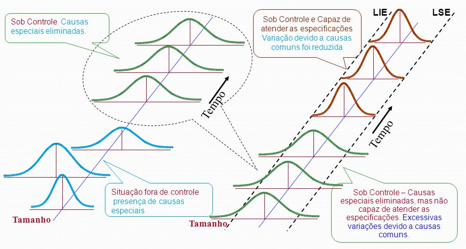

```{r setup, include=FALSE}
options(htmltools.dir.version = FALSE)
```

# Controle estatístico de processos

```{r echo=FALSE, message=FALSE, warning=FALSE}

```
---
# Controle estatístico de processos

```{r echo=FALSE, message=FALSE, warning=FALSE}
knitr::include_graphics("./img/cep_var.jpg")
```

---

# Variações e o CEP

```{r echo=FALSE, message=FALSE, warning=FALSE}
knitr::include_graphics("./img/Imagem1.png")
```

---

# Controle estatístico de processos

Os princípios do CEP fundamentam-se em: 

- pensar e decidir com base em fatos
- pensar separando a causa do efeito
- compreender a variabilidade do sistema de produção
- usar raciocínio de prioridade (Pareto)
- utilizar re forma permanente os ciclos de controle e melhoria de processos
- definir o próximo processo ou etapa como cliente da anterior e o  cliente deve determinar a qualidade esperada
- identificar, por vezes de maneira antecipada, os focos e locais onde problemas estão ocorrendo
- educar, treinar e organizar a mão de obra para administração participativa e autocontrole dos processos

---

# Técnicas de apoio
- Amostragem
- Folha de verificação
- Histograma
- Gráficos sequenciais
- Diagrama de Pareto
- Diagrama de causa e efeito
- Estratificação
- Gráficos de controle (ou cartas de controle ou Gráficos de Shewhart)
- Diagrama de correlação

---

# Variações e o CEP

Variação total = variação aleatória + variação controlável

## O Controle Estatístico de Processos (CEP) caracteriza-se por: 

- redução da variabilidade em medidas;
- exatidão em alcançar metas!

---

# Ações sobre o processo

## Mudanças nas operações
- Treinamento para os operadores;
- Mudanças nos materiais que entram

## Mudanças nos elementos mais básicos do processo
- Equipamento;
- A comunicação entre as pessoas;
- O projeto do processo como um todo - que pode estar vulnerável às mudanças de temperatura ou umidade.


---

# Ciclo da metodologia científica aplicado ao CEP
1. identificação da problemática e o planejamento de experimentos com a escolha adequada dos instrumentos de análise
2. experimentação 
3. análise de dados
4. reação dos gestores para melhoria do processo

---
# Inpeção x Controle

```{r echo=FALSE, message=FALSE, warning=FALSE}

```

---

# Gráficos de controle
## Principais objetivos de gráficos de controle:
1. Estimar os parâmetros do processo no cenário de controle estatístico, permitindo analisar sua capacidade;
2. Monitorar parâmetros da produção ao longo do tempo;
3. Sinalizar a ocorrência de causas de variação atribuíveis;
4. Reduzir a variabilidade do processo mediante eliminação das causas atribuíveis.

---
# Tipos de gráficos de control

- Gráficos de controle para variáveis
- Gráficos de controle para atributos

---
# Escolha dos instrumentos

```{r echo=FALSE, message=FALSE, warning=FALSE, out.width="50%"}
knitr::include_graphics("./img/Imagem2.png")
```


